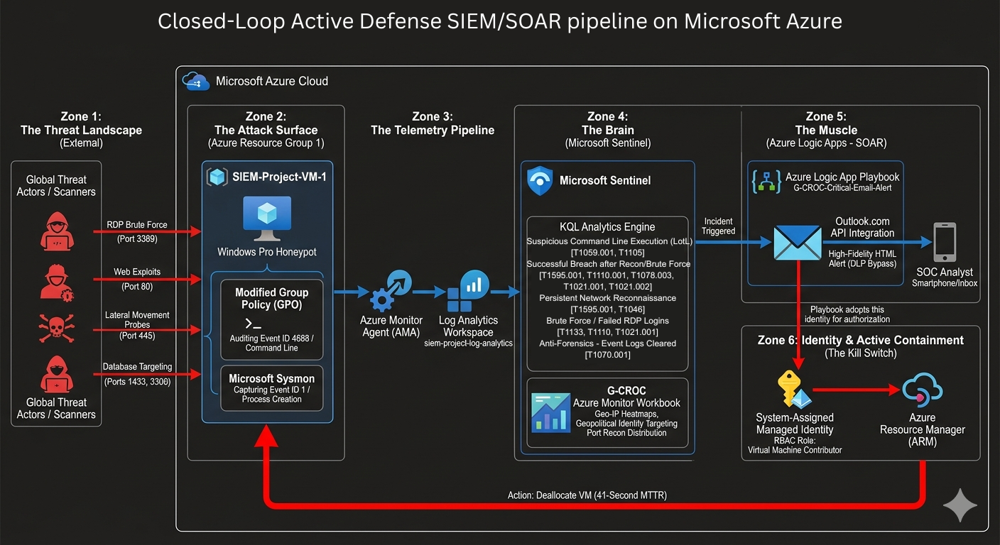
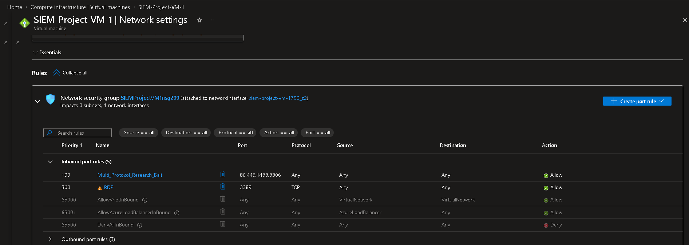
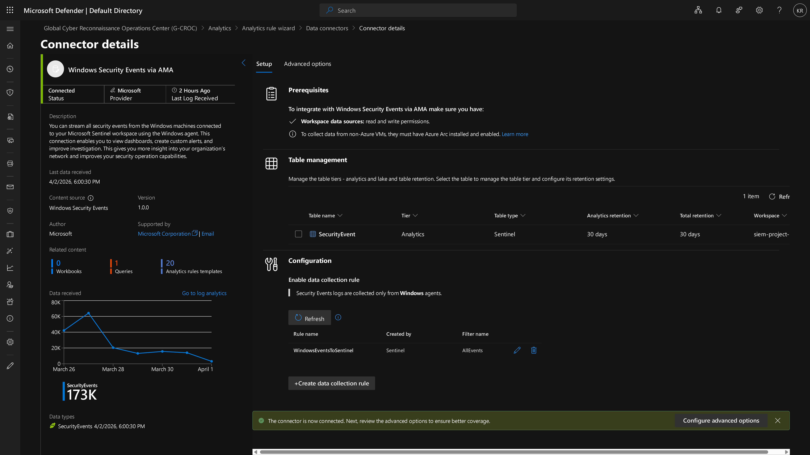
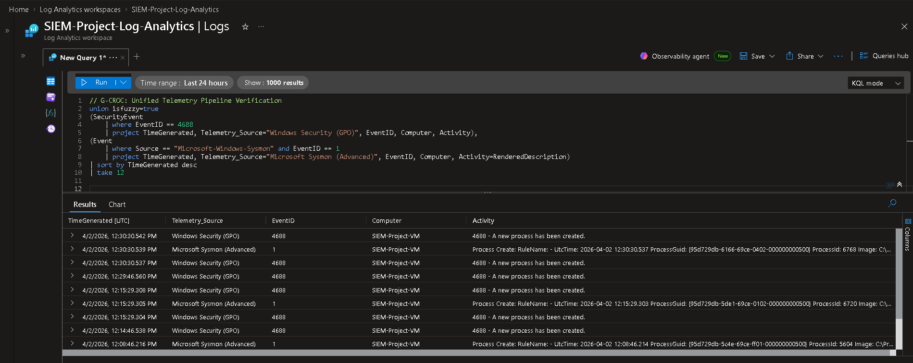
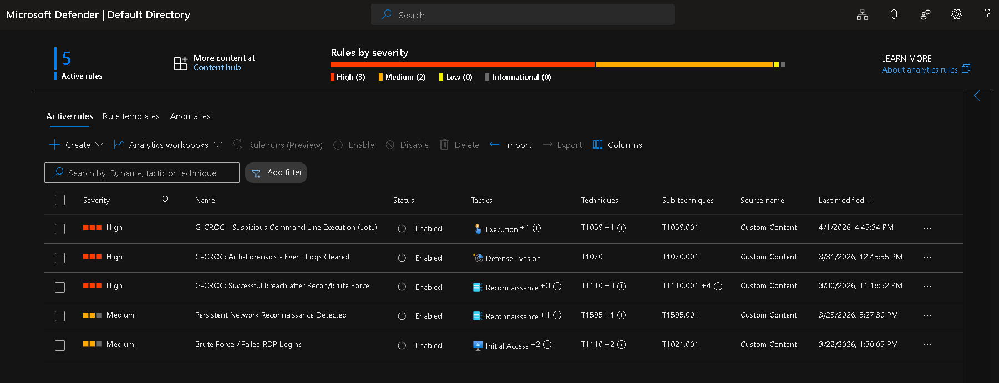
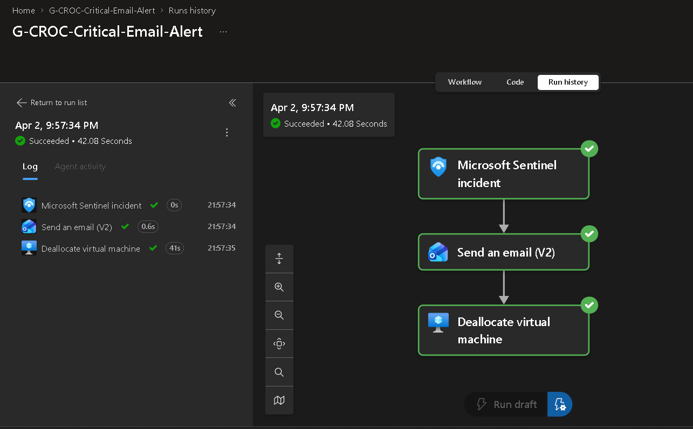
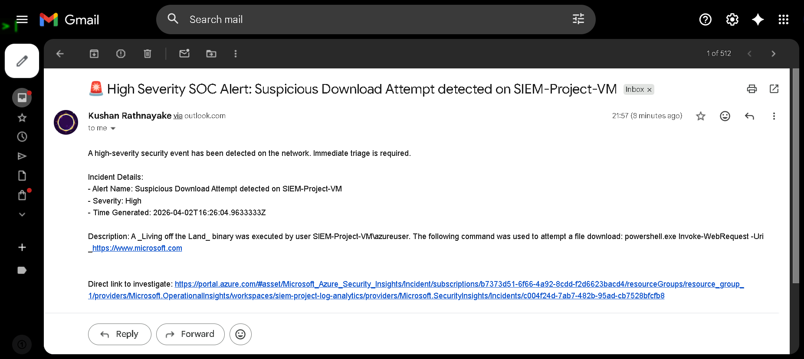

# G-CROC: Azure-Native Autonomous Active Defense & SIEM-SOAR Architecture

## 🛑 Executive Summary
The **Global Cyber Reconnaissance Operations Center (G-CROC)** is an enterprise-grade SIEM/SOAR pipeline built natively within Microsoft Azure. While many security labs focus on passive monitoring, this project implements an **Active Defense** methodology. 

By engineering a closed-loop automation pipeline, this architecture doesn't just "see" an attack, it autonomously isolates compromised assets. Leveraging Sysmon telemetry, custom KQL detection logic, and Azure Logic Apps, this system achieved a verified **42-second Mean Time to Respond (MTTR)** from the initial payload execution to total infrastructure containment.

---

## 🗺️ Architecture Overview

 

---

## 🚀 Pipeline Breakdown & Implementation

### Zone 1 & 2: The Threat Landscape & Attack Surface
To attract live threat actors, I provisioned a **Windows Pro Honeypot** (`SIEM-Project-VM-1`) in Azure and intentionally exposed critical ports (3389, 80, 445, 1433) to the public internet. 

Because standard Windows event logs are insufficient for detecting advanced "Living off the Land" (LotL) techniques, I hardened the OS to generate high-fidelity telemetry:
* **Modified GPO:** Enabled advanced auditing for Event ID 4688 to capture command-line arguments.
* **Microsoft Sysmon:** Deployed Sysmon using the SwiftOnSecurity configuration to monitor Event ID 1 (Process Creation), allowing visibility into stealthy PowerShell and Certutil executions.

---

### Zone 3: The Telemetry Pipeline
Once the honeypot began generating data, that telemetry needed to be securely transported to the SIEM.
* I configured the **Azure Monitor Agent (AMA)** via Data Collection Rules (DCR) to scrape the local Windows Security logs and the custom Sysmon operational channel.
* This data was continuously pushed into a centralized **Log Analytics Workspace** (`siem-project-log-analytics`), providing the raw data pool for the analytics engine.

---

### Zone 4: The Brain (Microsoft Sentinel)
This zone acts as the analytical core. I attached Microsoft Sentinel to the Log Analytics Workspace and authored **5 custom KQL Analytics Rules**, mapping each to the **MITRE ATT&CK** framework:
1. **Suspicious Command Line Execution (LotL)** [T1059.001, T1105]
2. **Successful Breach after Recon/Brute Force** [T1595.001, T1110.001, T1078.003, T1021.001, T1021.002]
3. **Persistent Network Reconnaissance** [T1595.001, T1046]
4. **Brute Force / Failed RDP Logins** [T1133, T1110, T1021.001]
5. **Anti-Forensics - Event Logs Cleared** [T1070.001]

#### **Visual Intelligence: G-CROC Azure Monitor Workbook**
To provide real-time situational awareness, I engineered a custom workbook to visualize the live attack data:

| Identity & Access Monitoring (RDP) | Network Reconnaissance (Port Probing) |
| :---: | :---: |
|  | .png) |
| .png) | .png) |
| .png) |  |

---

### Zone 5 & 6: The Muscle & Active Containment (SOAR)
When Sentinel's KQL engine detects a critical threat (like an LotL payload execution), it triggers the **Kill Switch** which is a custom Azure Logic App Playbook (`G-CROC-Critical-Email-Alert`).

1. **Triage (Zone 5):** The Logic App dynamically formats the incident data (Attacker IP, targeted account, payload) and fires a high-fidelity HTML email to the SOC using the Outlook API.
2. **Authorization (Zone 6):** To maintain zero-trust principles, the playbook executes under a **System-Assigned Managed Identity** with the specific *Virtual Machine Contributor* RBAC role, eliminating the need for exposed API keys.
3. **Containment (Zone 6):** The playbook issues a POST request to the Azure Resource Manager (ARM) API, forcefully deallocating the compromised virtual machine. 

| Automated Playbook Execution (42-Second MTTR) | High-Fidelity SOC Analyst Alert |
| :---: | :---: |
|  |  |

---

## 📈 Final Outcome
By simulating a live-fire attack against the honeypot, I verified that the entire closed-loop pipeline, from the exact second the malicious command was executed to the moment the Azure infrastructure physically deallocated the machine was completed in exactly **42 seconds**. 

This project successfully demonstrates the power of combining deep OS telemetry with cloud-native SOAR automation to drastically minimize attacker dwell time and enforce active containment.
